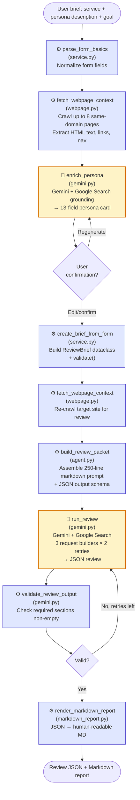

# PersonaLens — Reverse-Engineered PRD

## 1. Pipeline Purpose

PersonaLens is a **persona-based quality review platform** for public pre-login web experiences. It takes a minimal user-supplied brief (service URL/name/type, core journey, business goal, persona description, known problems, optional competitors) and produces a **structured JSON review** scoring the landing-to-onboarding experience through the lens of a specific target user.

**Problem solved**: Teams want user-grounded UX evaluations of their marketing/onboarding pages but lack dedicated researchers. PersonaLens automates the two-stage process a researcher would perform:
1. Build a realistic target persona (grounded in web research + user description)
2. Evaluate the live website against that persona's stated goals, journey, and business objectives

The review is delivered as JSON (for programmatic use) and rendered as markdown (for humans), with scoring across 8 UX dimensions, prioritized findings (Blocker/High/Medium/Nit), strengths, and tiered improvements (quick wins, structural fixes, validation experiments).

The system exposes the same pipeline through four entry points: **CLI** (`personalens build|run`), **Web UI** (ThreadingHTTPServer), **Interactive terminal**, **Claude Code Skill**, and **Slack slash-command bridge**.

---

## 2. Pipeline Architecture

### Mermaid Diagram



Legend: 🤖 = LLM node (optimizable via prompt engineering); ⚙️ = Code node (optimizable via Python logic).

### Node-by-Node Breakdown

| # | Node ID | Type | Function | Role |
|---|---------|------|----------|------|
| 1 | `parse_form_basics` | Code | `service._parse_form_basics` | Normalize unicode, split competitors/problems, default service_type |
| 2 | `fetch_webpage_context` | Code | `webpage.fetch_webpage_context` | Crawl up to 8 same-domain pages via `urllib` + stdlib `HTMLParser`. Skip script/style. Extract text (2200 char cap/page), links, nav items, aria-labels. SSRF-guarded. |
| 3 | `enrich_persona` | **LLM** | `gemini.enrich_persona` | Call Gemini with Google Search tool to generate 13-field persona card JSON from raw user description + webpage snapshot |
| 4 | `create_brief_from_form` | Code | `service.create_brief_from_form` | Construct `ReviewBrief` dataclass; run `.validate()` to enforce non-empty fields, URL scheme, confidence/device enums |
| 5 | `build_review_packet` | Code | `agent.build_review_packet` | Compose a ~250-line markdown packet: SYSTEM_PROMPT + review goal + persona card + competitors + evidence + website context + journey stages + 8 scoring dimensions + execution instructions + output schema |
| 6 | `run_review` | **LLM** | `gemini.run_review` | Send packet to Gemini with JSON response format. Retry strategy: 3 request builders (with systemInstruction+search, inline prompt, plain-text fallback) × 2 attempts each = up to 6 API calls. |
| 7 | `validate_review_output` | Code | `gemini.validate_review_output` | Verify required top-level JSON sections (`review_summary`, `persona_card`, `scores`, `prioritized_improvements`) are populated and either `strengths` or `findings` is non-empty |
| 8 | `render_markdown_report` | Code | `markdown_report.render_markdown_report` | Convert JSON review into human-readable markdown with scores table, findings list, improvements |

---

## 3. LLM Configuration

| Node | Model (default) | Temperature | Response Format | Tools |
|------|-----------------|-------------|-----------------|-------|
| `enrich_persona` | `gemini-2.5-pro` | Default (not set) | `application/json` | Google Search (fallback: no tools) |
| `run_review` | `gemini-2.5-pro` | Default (not set) | `application/json` (except plain-text fallback builder) | Google Search (first builder only) |

- API transport: raw `urllib.request` against `https://generativelanguage.googleapis.com/v1beta/models/<model>:generateContent?key=<key>`
- Timeout: `GeminiConfig.timeout_seconds = 45`
- API key env var: `GEMINI_API_KEY`
- Model is overridable per call (e.g., `--model gemini-2.5-flash`)

---

## 4. Prompt Inventory

### 4.1 `enrich_persona` prompt (LLM)
- **Location**: `src/personalens/gemini.py:242-304` (inline f-string in `enrich_persona`)
- **Structure**:
  - Role declaration ("You are a UX research expert.")
  - Three prescribed Google Search queries (service name, `{type} user persona`, `{type} user pain points`)
  - **CRITICAL RULE ON COMPETITORS** (strict no-product-name policy unless user-provided)
  - Inputs block: service, URL, core journey, business goal, user description, known problems, webpage snippet (3000 char cap)
  - Task statement (grounded in description → web research → industry knowledge)
  - Exact JSON schema example with 14 fields (includes `web_research_summary`)
  - Language matching instruction (English default, match Korean if inputs are Korean)

### 4.2 `run_review` packet (LLM)
- **Location**: `src/personalens/agent.py:11-54` (`SYSTEM_PROMPT`) + `agent.py:148-255` (`build_review_packet`)
- **Request builders** (`gemini.py:139-219`):
  1. `build_request_with_system_instruction` — systemInstruction + google_search tool + JSON responseMimeType
  2. `build_request_inline_prompt` — inline preamble, no tool, JSON responseMimeType
  3. `build_request_plain_text_fallback` — no tool, no responseMimeType hint
- **Packet sections** (markdown headers):
  - `## System Prompt` — 54-line SYSTEM_PROMPT covering evaluation philosophy, JS-dynamic-content warning, strict competitor rule
  - `## Review Goal` — service, URL, review goal, core journey, business goal
  - `## Persona Card` — 13 persona fields
  - `## Known Competitors` — the ONLY product names model may mention
  - `## Evidence` — user-provided evidence bullets
  - `## Website Context` — crawled page excerpts + nav items
  - `## Constraints` / `## Notes`
  - `## Journey Stages To Review` — Entry, Orientation, Task start, Core action, Error recovery, Completion, Follow-up/Retention cue
  - `## Scoring Dimensions` — task_clarity, task_success, effort_load, trust_confidence, value_communication, error_recovery, accessibility, emotional_fit
  - `## Execution Instructions` — 17 numbered rules anchored to stated business goal/persona
  - `## Reflection Loop` — 7 VALIDATION_CRITERIA + 4 additional checks
  - `## Required Output Schema` — embedded JSON Schema block

### 4.3 Retry guidance (LLM)
- On failed attempts, `run_review` injects `## Retry Note` into the next request with the specific failure reason (API error, empty response, invalid JSON, or empty top-level section).

---

## 5. Metrics

**No automated training/evaluation metrics exist in the repository.** PersonaLens is a service, not an ML model. However, the LLM self-enforces quality via:

- **Structural validity** (`validate_review_output` in `gemini.py:115-123`):
  - `review_summary`, `persona_card`, `scores`, `prioritized_improvements` must be non-empty (not `None`, `{}`, or `[]`)
  - Either `strengths` or `findings` must be non-empty
- **Schema validity**: LLM response is parsed as JSON; malformed JSON triggers retry
- **Brief validity** (`models.ReviewBrief.validate`): Non-empty required fields, http/https URL, persona.confidence ∈ {low, medium, high}, device_context ∈ {mobile, desktop, mixed}, ≥1 goal, ≥1 pain point, ≥3 voice anchors, ≥1 evidence source

Implicit quality signals that could be turned into metrics during optimization:
- Score distribution across 8 dimensions (1–5)
- Count of findings per priority tier
- Presence of journey-stage attribution per finding/strength
- Business-goal anchoring (every recommendation must tie to stated business goal)
- Competitor-rule compliance (no unauthorized product names)

---

## 6. Data Sources

### Runtime inputs
- **User brief JSON** (CLI): `examples/brief.json` format — `ReviewBrief.from_dict(...)`
- **HTML form** (Web UI): POST `/persona`, POST `/review`
- **Slack slash command**: `POST /slack/commands` parsed into a mini brief
- **Claude Code Skill**: JSON handoff via `skill_helper.py`

### Reference data
- **Output schema template**: `review-output-schema.json` (project root) — defines 7 top-level JSON sections and their shape
- **Live website content**: fetched on demand via `fetch_webpage_context(url)` — stdlib `urllib` + `HTMLParser`, no JS execution, 8-page crawl, 2200 char/page cap
- **Google Search** (optional): Gemini-side tool; produces grounded citations for persona enrichment and competitor research

### No training/evaluation datasets
There are no `train/val/test` datasets. The repository has one example brief (`examples/brief.json`), no fixtures, no labelled corpora. Any optimization harness will need to **synthesize** evaluation briefs and quality judges.

### Generated artifacts (written during execution)
- `review-{service}-{timestamp}.md` — final markdown report
- `build/review-packet.md` — prompt sent to Gemini
- `build/output-skeleton.json` — expected JSON structure
- `build/gemini-raw-response.json` — raw API response
- `gemini-last-request.json`, `gemini-last-error.txt` — debug dumps

---

## 7. I/O Overview (End-to-End)

### End-Input (what the end-user provides per request)

The user-facing contract comes from (a) the CLI's `ReviewBrief` JSON (`examples/brief.json`) and (b) the web form's `data` dict consumed by `service.generate_persona_from_form` and `create_brief_from_form`. The **richer CLI form** (which is also what the webapp produces after persona confirmation) is shown below.

```json
{
  "service": {
    "name": "MEGA Code",
    "url": "https://www.megacode.ai/",
    "type": "AI agent development web product"
  },
  "review_goal": "Evaluate whether a developer who wants to build agents can understand MEGA Code's value quickly enough to start onboarding.",
  "core_journey": "Land on the site, understand what MEGA Code does, decide whether it seems useful, and start onboarding through login or GitHub.",
  "business_goal": "Increase the rate of qualified developer visitors who start onboarding after understanding the product's practical value.",
  "persona": {
    "name": "Agent-Building Developer",
    "segment": "A developer evaluating new AI agent tools...",
    "job_to_be_done": "Figure out quickly whether MEGA Code will materially help me build better agents.",
    "context": "Arrives from a recommendation or search result while exploring agent tooling.",
    "goals": ["Understand what the product actually does", "Know whether it helps real agent-building work"],
    "pain_points": ["AI tools often sound impressive but do not improve real output"],
    "technical_level": "high",
    "decision_style": "comparison-heavy and trust-driven",
    "device_context": "desktop",
    "access_needs": ["Clear plain-English explanation of product value"],
    "success_definition": "I understand what this does, why it is different, and why I should sign in now.",
    "voice": ["skeptical", "practical", "results-oriented", "low-hype", "time-conscious"],
    "evidence_sources": ["founder-provided observation about uncertainty around usefulness"],
    "confidence": "medium"
  },
  "evidence": ["Observed concern: users may not understand whether MEGA Code is actually useful before onboarding."],
  "known_constraints": ["Limit the review to the landing-page-to-onboarding decision journey."],
  "notes": ["Separate observation, inference, and recommendation."],
  "competitors": []
}
```

Field-level notes:
- `service.url` (string, required): must be `http(s)://` and not `example.com`.
- `persona.confidence` (enum): `"low" | "medium" | "high"`.
- `persona.device_context` (enum): `"mobile" | "desktop" | "mixed"`.
- `persona.voice` (list[str], ≥3 anchors required).
- `competitors` (list[str], optional): the **only** external product names the LLM is permitted to mention.

For the lighter **web form** path, the user provides only: `service_name`, `service_url`, `service_type`, `core_journey`, `persona_description`, `business_goal`, `problems`, `competitors`, `model`. Nodes 3-4 then generate the full `ReviewBrief` automatically.

### End-Output (what is returned to the end-user)

Shape from `review-output-schema.json` — all top-level sections are required and non-empty per `validate_review_output`.

```json
{
  "review_summary": {
    "verdict": "The landing page positions MEGA Code as an agent platform but delays its core proof until after login.",
    "scope": "Public landing → onboarding decision",
    "persona_name": "Agent-Building Developer",
    "persona_segment": "A developer evaluating new AI agent tools",
    "confidence": "medium",
    "first_impression": "Hero copy is clean, but the persona cannot tell in 10 seconds what MEGA Code actually does differently.",
    "why_it_matters": "Skeptical developers bounce when value is vague before onboarding."
  },
  "persona_card": {
    "job_to_be_done": "Figure out quickly whether MEGA Code will materially help me build better agents.",
    "context": "Arrives from a recommendation while exploring agent tooling.",
    "goals": ["Understand what the product does", "Know whether it helps real work"],
    "pain_points": ["AI tools sound impressive but do not improve real output"],
    "technical_level": "high",
    "decision_style": "comparison-heavy and trust-driven",
    "device_context": "desktop",
    "access_needs": ["Plain-English value explanation"],
    "voice_anchors": ["skeptical", "practical", "low-hype"],
    "evidence_sources": ["user description", "website snapshot"]
  },
  "scores": {
    "task_clarity": { "score": 3, "reason": "Headline hints at agent tooling but does not name the outcome." },
    "task_success": { "score": 2, "reason": "No clear next step before login." },
    "effort_load": { "score": 4, "reason": "Page is short; not heavy to scan." },
    "trust_confidence": { "score": 2, "reason": "No proof assets, customer logos hidden." },
    "value_communication": { "score": 2, "reason": "Benefits abstract, no concrete 'what it does'." },
    "error_recovery": { "score": 3, "reason": "Not applicable pre-login; no broken states observed." },
    "accessibility": { "score": 4, "reason": "Copy readable; icon links carry aria-labels." },
    "emotional_fit": { "score": 3, "reason": "Tone professional but lacks credibility cues this persona seeks." }
  },
  "strengths": [
    {
      "title": "Clean visual hierarchy on landing hero",
      "journey_stage": "Entry",
      "persona_reason": "A skeptical developer appreciates a non-overwhelming first screen.",
      "evidence": "Hero contains one headline, one subhead, and two CTAs."
    }
  ],
  "findings": [
    {
      "priority": "Blocker",
      "title": "Landing page does not answer 'What does MEGA Code actually do?'",
      "journey_stage": "Orientation",
      "problem": "No concrete example or outcome shown before the login gate.",
      "persona_voice": "I can't tell if this saves me time on real agent work.",
      "evidence": "Hero copy says 'Build better agents' without naming a capability or output.",
      "impact_on_user": "Leaves without trying; assumes hype.",
      "impact_on_business": "Qualified developer traffic bounces before the onboarding funnel.",
      "improvement_direction": "Show a 10-second concrete demo or a named capability above the fold."
    }
  ],
  "prioritized_improvements": {
    "quick_wins": [
      {
        "change": "Replace the hero subhead with a concrete capability statement (e.g., 'Review, diff, and deploy agent prompts in one place').",
        "expected_user_outcome": "Persona understands the category in 10 seconds.",
        "expected_business_outcome": "Higher qualified-developer onboarding starts.",
        "estimated_effort": "low"
      }
    ],
    "structural_fixes": [
      {
        "change": "Add a 'How it works in 30 seconds' section with one screenshot or GIF.",
        "expected_user_outcome": "Skeptical persona sees proof before login.",
        "expected_business_outcome": "Reduces bounce pre-onboarding.",
        "estimated_effort": "medium"
      }
    ],
    "validation_experiments": [
      {
        "experiment": "A/B test concrete vs. abstract hero copy.",
        "hypothesis": "Concrete capability copy lifts onboarding-start rate among developer traffic.",
        "success_metric": "Onboarding-start conversion among /ref=github visitors."
      }
    ]
  },
  "open_questions": [
    "What is the single most common agent-building task MEGA Code shortens today?"
  ]
}
```

The webapp additionally returns a rendered markdown HTML page (`markdown_report.render_markdown_report(result)`); the CLI writes both `--output result.json` and the raw Gemini response.

### Document Store (Background Reference Data)

PersonaLens does not load a static document store at startup. It has two on-demand reference sources instead:

1. **Live webpage crawl** — `fetch_webpage_context(url)` → string. Schema:
   ```
   - Crawled pages: <N>
   - NOTE: This text was extracted from raw HTML without JavaScript execution...
   - Page 1 URL: <url>
   - Page 1 title: <title>
   - Page 1 text excerpt: <up to 2200 chars of stripped text>
   - Page 1 navigation/icon links: [Link: <label> → <url>] | ...
   - (repeats for up to 8 pages)
   ```
   Loading method: stdlib `urllib.request` + `html.parser.HTMLParser`, SSRF-guarded (`is_safe_request_url`), 5 max redirects, `Mozilla/5.0 QualityReviewAgent/0.1` UA. Same-domain BFS starting from the landing URL, prioritizing links via `prioritize_links`.

2. **Output schema template** — `review-output-schema.json` (loaded by `agent.load_schema(Path)` → dict). An 80-line JSON template converted to JSON Schema by `_schema_from_template` and embedded in the prompt packet.

Neither is a traditional document corpus; there is no vector store, no knowledge base, and no historical review database.

---

## 8. Optimizable Elements

### 8.1 Prompt templates (LLM nodes)
- **`enrich_persona` prompt** — one inline f-string in `gemini.py:242-304` (63 lines of instruction + schema example). Redundant language/competitor warnings; could be consolidated.
- **`SYSTEM_PROMPT` + Execution Instructions** — `agent.py:11-54` (54 lines) + `agent.py:217-237` (17 numbered rules). Significant overlap on competitor rule (stated in system prompt, execution instructions, and `## Known Competitors` header). Reflection Loop (`agent.py:239-247`) restates validation criteria again.
- **Output schema embedding** — the entire 80-line schema is JSON-dumped inside the prompt. Moving this to the Gemini `responseSchema` parameter would shorten the prompt by ~150 tokens.
- **Journey/scoring dimensions** — hardcoded lists in `agent.py`; could be made dynamic per service type.

### 8.2 LLM parameters (LLM nodes)
- **Model** — `gemini-2.5-pro` hardcoded as `GeminiConfig.model` default; configurable via CLI `--model` and web form `model` select. Persona enrichment might be downgradable to `gemini-2.5-flash` for speed/cost.
- **Temperature** — not set; using Gemini's default (~0.7 typically). No exposure.
- **Tools** — `google_search` used in first request builder for both nodes. Could be restricted to specific domains or cached.
- **Timeout** — 45s hardcoded in `GeminiConfig.timeout_seconds`.
- **Retry strategy** — 3 builders × 2 attempts = 6 API calls worst case. No exponential backoff; no error-type discrimination (retries on any failure). Opportunity: retry only on validation failures, not API errors.

### 8.3 Code logic (Code nodes)
- **`fetch_webpage_context`** — No caching across persona + review stages (fetched twice per request). Sequential crawling (8 pages serial). No JS execution.
- **`_schema_from_template`** — custom recursive JSON Schema generator; could use `pydantic` or `jsonschema` library.
- **`infer_voice_anchors` / `infer_technical_level`** — regex keyword matching; hardcoded dictionaries; could be data-driven or LLM-based.
- **`validate_review_output`** — structural only (empty check); no semantic validation (e.g., are scores 1-5, does every finding cite evidence, is every recommendation anchored to business goal).
- **`normalize_user_text` / `normalize_url_text`** — redundant unicode smart-quote stripping.
- **`build_review_packet` section ordering** — fixed order; could A/B test (e.g., persona card before system prompt).

### 8.4 Pipeline structure
- **Fold persona enrichment into review generation** — currently 2 LLM calls; could become one (with a `persona` section in the output schema) for cost/latency savings. Trade-off: loses the user-confirmation step.
- **Add a post-review critic/judge node** — a second LLM pass that checks compliance with the execution instructions (competitor rule, business-goal anchoring, Blocker/High/Medium/Nit discipline) and requests revisions.
- **Split the web crawl** — today it's one blocking `fetch_webpage_context`; could be async with per-page timeouts.
- **Cache persona by (service_name, service_type, persona_description) hash** — 30-40% latency savings for repeated services.
- **Convert code heuristics → LLM** or **LLM prompts → code validators** — e.g., pre-validate evidence completeness before calling Gemini; move competitor enforcement from prompt to a post-response filter.

---

## 9. Non-Algorithm Elements (UI/UX)

(Stack report flagged this project as having significant non-algorithm surface area; optimization should include these.)

- **Form field ordering**: Service metadata → persona description → business goal → known problems → competitors. Matches the mental model of "what you're reviewing → who's reviewing → why".
- **Two-stage submission**: Form → persona confirmation → review. User can edit/regenerate the AI-generated persona before review. Trade-off between trust-building and friction.
- **Skeleton loader with shimmer**: 1.6s keyframe animation on placeholder blocks during the ~30-60s review wait.
- **Color-coded confidence pill**: high=green, medium=yellow, low=red.
- **Color-coded scores**: ≥4 green, ≥3 yellow, <3 red. Eight-dimension dashboard.
- **Priority badges**: Blocker, High, Medium, Nit with context colors.
- **Bilingual UI**: English/Korean toggle via `data-en`/`data-ko` attributes, persisted to `localStorage`.
- **Auto-reconnect banner**: `/health` polled every 1.5s; page reloads when server recovers.
- **Earth-tone palette**: background `#f4efe6`, accent `#0e6b58` (teal), accent-2 `#d97a2b` (orange). Warm/non-techy aesthetic, distinguishing from typical devtool dashboards.
- **Responsive breakpoints**: 860px (form), 768px (results). Sticky tips sidebar collapses on mobile.
- **Typography**: Pretendard font (CJK + Latin) via CDN.
- **Accessibility**: semantic form labels, URL input type, viewport meta, clear button text; no automated WCAG audit.

---

## 10. Metrics & Targets

No explicit target accuracy, F1, or primary metric target is declared in the codebase, README, or PRD. Optimization will rely on synthesized judges and structural metrics (see §5).

---

## 11. Entry Points

- **CLI**: `personalens run --input examples/brief.json --output result.json --model gemini-2.5-pro` → `src/personalens/cli.py:run_gemini` → `service.run_review_for_brief`
- **CLI (packet only)**: `personalens build --input brief.json --output packet.md` → `cli.run_build` (no Gemini call)
- **Web UI**: `python -m personalens.webapp` → ThreadingHTTPServer on configurable port → `POST /persona`, `POST /review`
- **Interactive terminal**: `python -m personalens.interactive` → `interactive.main`
- **Claude Code Skill**: JSON bridge via `skill_helper.py`
- **Slack slash-command**: `personalens slack-serve` → `slack_server.serve_slack_commands` → `POST /slack/commands`

The **canonical optimizable workflow** is the CLI `run` path → `run_review_for_brief` (it exercises both LLM nodes and all code nodes end-to-end).
